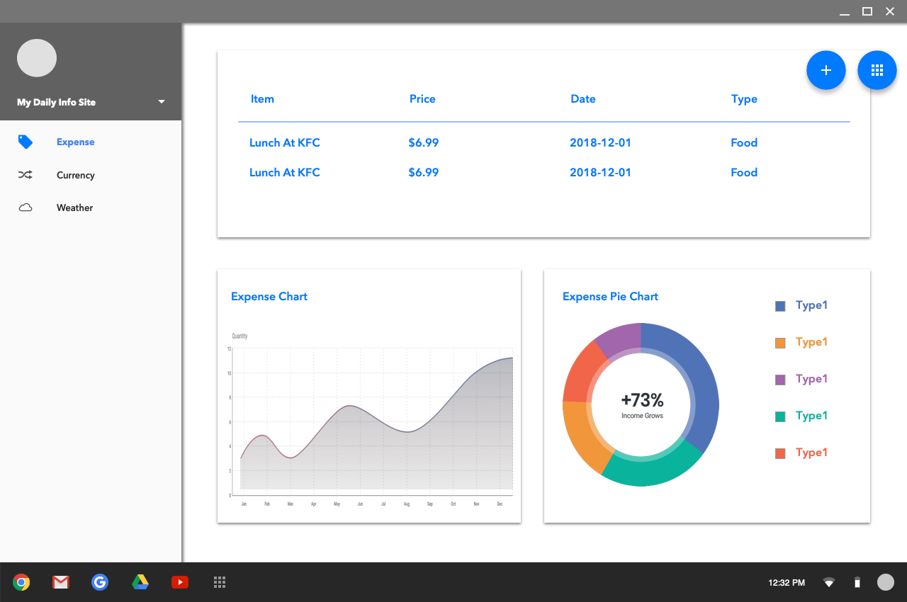

## Daily Info

### This is an app used to display useful daily information
The app is currently served by Zeit Now, and data is store at mLab.
[Click to Preview](https://daily-info-xwwnquxbix.now.sh/)

### so far this app has 3 main features:
1. Money: save daily expense details, draw chart of them;
2. Currency: get the daily currency rate, send notifications when the rate is beyond or below a certain value, save these data and make tables and charts of them;
3. Weather: get the location of user, show the Weather data of that.

### prototypes
These prototypes are made by Sketch, there only include export pngs.
#### Expense page

#### Expense page when add an expense item

#### Expense page when adjust the time

#### Currency page


### Techs: React, Material-UI, D3.js, Redux, axios, express, MongoDB, Koa2

### Structure of Front-end Parts

Front-end files are under 'src'.
All the reusable components are in 'components' folder.
All pages are under 'pages', the capitalized Component is the structure of the page, the lowercase folder contains all special components used for this page, they are usually an instance of reusable components.
The routers are under the 'routes', just a map for React-router to find the correct page component for the url.
Since this app use Redux as a state management lib, actions and reducers can be found in the folder of the same name.
Other folders, 'themes' is for the basic seetings of Material-UI; 'utils' is for all helper functions.
```
├── App.js
├── App.test.js
├── actions
│   ├── expense.js
│   └── notification.js
├── components
│   ├── EnhancedTable.js
│   ├── Header.js
│   ├── Layout.js
│   ├── Modal.js
│   ├── Navbar.js
│   ├── Notification.js
│   └── charts
│       ├── LineChart.js
│       └── PieChart.js
├── index.js
├── logo.svg
├── pages
│   ├── Currency.js
│   ├── Expense.js
│   └── expense
│       ├── ExpenseAddForm.js
│       ├── ExpenseLineChart.js
│       ├── ExpensePieChart.js
│       ├── ExpenseTable.js
│       └── ExpenseTypeIcon.js
├── reducer
│   ├── currency.js
│   ├── expense.js
│   ├── index.js
│   └── notification.js
├── routes
│   └── routes.js
├── serviceWorker.js
├── themes
│   └── theme.js
└── utils
    └── timeFormat.js
```


### Structure of Back-end Parts
Back-end codes are under 'server'

Entry file is 'index.js'.
Folder 'routes' is how koa app handle the routers or requests; all data api are prefixed with '/api', all get requests without '/api' will be handled as a page request, the path will be passed as a parameter, response is always the 'index.html', then the Front-end part will deal with the router. For api routes, similar to Restful API, it assigned different controllers.

Folder 'model' is for all data structure stored in MongoDB

Folder 'controllers' includes all the actions toward database, they are all exported as functions for api routes files.

```
├── controllers
│   └── expense.js
├── index.js
├── models
│   └── expense.js
└── routes
    ├── expense.js
    └── index.js
```
